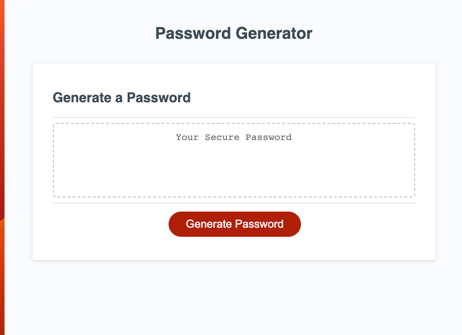
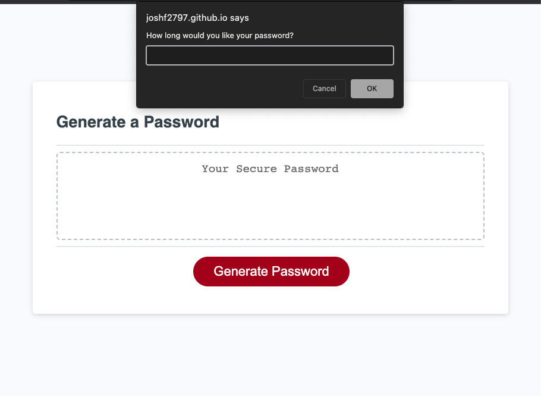
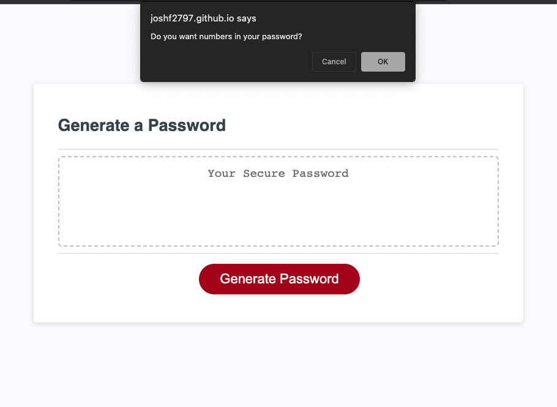
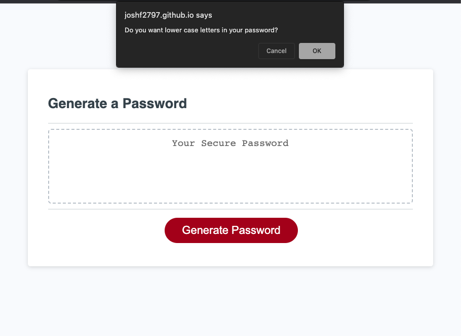

# Password Generator

**[View Deployed Site](https://joshf2797.github.io/Challenge-3/)**

## This app is a simple Password Generator

As a user I want to generate a password and given the options to select the length and whether I want upper case, lower case, numbers and symbols in my password. 

## After clicking the "Generate Password" button you will be provided with a series of prompts.

  *First prompt will ask you how long you want your password to be.
 

 *The next prompt will ask you if you would like numbers in their password.
 

 *The next prompt will ask if user would like lower case letters in their password.
 

 *The next prompt will ask if user would like upper case letters in thier password.
 

 *And the last prompt will ask if the user would like symbols in their password.
 